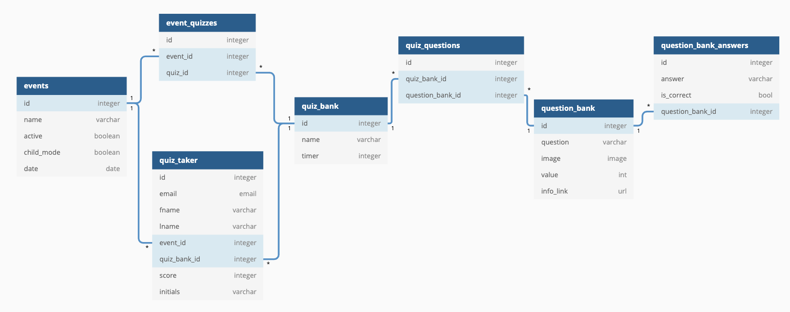

# Urban Green Lab Gameventify

[](https://app.netlify.com/sites/uglapp/deploys)

[Development Site](https://uglapp.netlify.app)

[Team Notes](https://docs.google.com/document/d/1jD16iYyyfLIwJWif1GmEZSLwIdyAaQgOXpkWttVGTV8/edit#)

This application is used to create quizzes that can be administered at events or on the internet.

There is a backend admin site as well as a user application for game play, which also includes a leaderboard.

## Table of Contents
- [Tech Stack](#tech-stack)
- [Features](#features-tech-roadmap)
- [Get Started Developing](#get-started)
- [Clone Repo](#clone-the-repo)
- [Installs](#installs)
- [Code Reviews](#code-reviews)
- [Deployment](#deployment)
- [Data Structure/ERD](#data-structureerd)
- [Contributors](#contributors)

## Tech Stack:
- **Frontend:**
  - ReactJS
  - Redux for state management
- **Backend**
  - Python
  - Django Admin for Admin portal for creating events and quizzes
- **Deployment**
  - FE - Netlify
  - BE - Heroku
- **Styles**
  - SASS
  - [Reactstrap](https://reactstrap.github.io/)

## Features (Tech Roadmap)
- Child mode
    - the application will not collect personal identifiable information from kids under the age of 13. 
    - If the admin sets an event on child mode, the users will play the game, get a score, and be added to the leaderboard. There is no information collected
- Administration panel
    - Administrators can create, edit, and update events
    - Administrators can create, edit, and update quizzes
    - Administrators can create, edit, and update quiz questions
    - Admin can download csv files that include info about quiz takers to upload to any CRM software program
- Separate game application for users
    - A distraction free interface that allows users to beat the clock as they try to gain the high score while also learning about the environment and sustainability
    - Non-child users receive an email with the info on their quiz along with links to to resources and more information about UGL

## Get Started
Get started with local development. 

### Clone the Repo
```
$ git clone git@github.com:Urban-Green-Lab/application.git
$ cd application
```

## Installs
#### Front-End Development
```shell
$ cd browser
$ npm i
$ npm start
```

#### Back-End Development
Start postgres server with DB name and username `postgres`

```shell
# Go to the API directory
$ cd api

# Create a virtual environment to isolate our package dependencies locally
$ python3 -m venv uglenv
$ source uglenv/bin/activate  # On Windows use `uglenv\Scripts\activate`

# install necessary dependencies
$ pip install -r requirements.txt

# install postgres
$ brew install postgres
$ ln -sfv /usr/local/opt/postgresql/*.plist ~/Library/LaunchAgents

# Create two new aliases to start and stop your postgres server. They could look something like this:
# alias pg_start="launchctl load ~/Library/LaunchAgents/homebrew.mxcl.postgresql.plist"
# alias pg_stop="launchctl unload ~/Library/LaunchAgents/homebrew.mxcl.postgresql.plist"

# Refresh New Settings
$ source ~/.zshrc # source ~/.bashrc if using bash

# Use this command to start your database service.
$ pg_start 

# Create database
$ createdb postgres

# Create user postgres on database
$ createuser -s postgres

# Start server 
$ python manage.py runserver
# navigate to http://127.0.0.1:8000/admin. You should see a login screen

# Migrate (make sure you are in the api directory)
$ python manage.py migrate

# Create Super User
$ python manage.py createsuperuser

Username (leave blank to use 'YOUR_USER_NAME'): PRESS ENTER
Email address: PRESS ENTER
Password: 1234
Password (again): 1234
Bypass password validation and create user anyway? [y/N]: y
```
***Be sure to stop your db server when not developing use this command***
```shell
$ pg_stop
```

<!-- TODO: REMOVE FOR PRODUCTION -->
## Code Reviews
- Create a branch for the issue you are working on and create all PRs against the `development` branch.
  - A preview deploy will be created for testing
  - Once approved by 2 reviewers, you can merge into development
- Once the feature has been fully tested with all other code, a PR is created against `master` and merged into production.

## Deployment
We are deploying the FE and BE separately to decouple the deployments and updates.

**Frontend**
- For UGL, we chose Netlify, a free resource. Here is a [step-by-step guide](https://www.netlify.com/blog/2016/09/29/a-step-by-step-guide-deploying-on-netlify/) to get that set up. There is continuous deployment set up for the production branch. Netlify also offers deployment logs, rollbacks, and branch deploys for testing.

**Backend**
- We are deploying on Heroku
- INSTRUCTIONS COMING SOON

## Data Structure/ERD
[](https://dbdiagram.io/d/5f95f1fa3a78976d7b79179a)

## Contributors
### Team Leads
- <a href="https://github.com/meg723" target="_blank">**Meg Underwood (Project Manager)**</a>
- <a href="https://github.com/drteresavasquez" target="_blank">**Dr. Teresa Vasquez (Tech Lead)**</a>

### UX/UI
- <a href="https://github.com/bdoves" target="_blank">**Bodhi Stewart**</a>


### Designers
- <a href="https://github.com/ryan-firm" target="_blank">**Ryan Firm**</a>
- <a href="#" target="_blank">**Nick	Miller**</a>

### Front End Engineers
- <a href="https://github.com/drteresavasquez" target="_blank">**Dr. Teresa Vasquez**</a>
- <a href="https://github.com/prafullatass" target="_blank">**Prafullata	Sonawane**</a>
- <a href="https://github.com/jeremybdavis" target="_blank">**Jeremy	Davis**</a>
- <a href="https://github.com/vieraruben" target="_blank">**Ruben Viera**</a>

### Back End Engineers
- <a href="https://github.com/TrinityTerry" target="_blank">**Trinity Christiana**</a>
- <a href="https://github.com/RefreshingChi" target="_blank">**Chiitra Tibbs**</a>
- <a href="https://github.com/hannahhall" target="_blank">**Hannah Hall**</a>

### QA
- <a href="#" target="_blank">**Ankaj	Goel**</a>
- <a href="#" target="_blank">**Summer	Perkey**</a>
